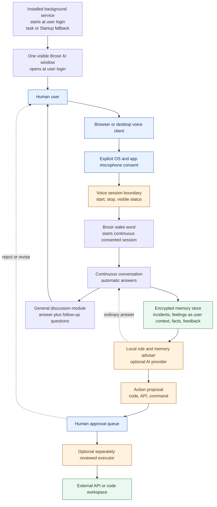

# Human Advisor AI Architecture

The API service can run continuously after installation and one visible Brosir AI window opens at user login. The local rule-and-memory adviser answers without an API key; an optional provider can improve wording but is not required. The voice path is opt-in and reversible. `Brosir` is recognized once after explicit consent starts a listening session; subsequent client-transcribed phrases continue in that session until Stop or disconnect. The service does not access a microphone by itself, does not claim to experience feelings, and does not execute critical proposals without a human decision.