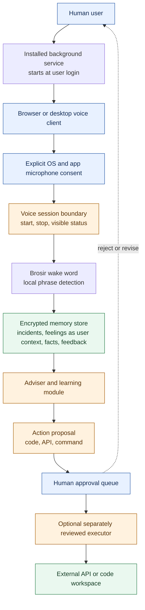

# Human Advisor AI Architecture

The API service can run continuously after installation and starts at user login, but the voice path is opt-in and reversible. `Brosir` is recognized only after explicit consent starts a listening session. The service does not access a microphone by itself, does not claim to experience feelings, and does not execute proposals without a human decision.